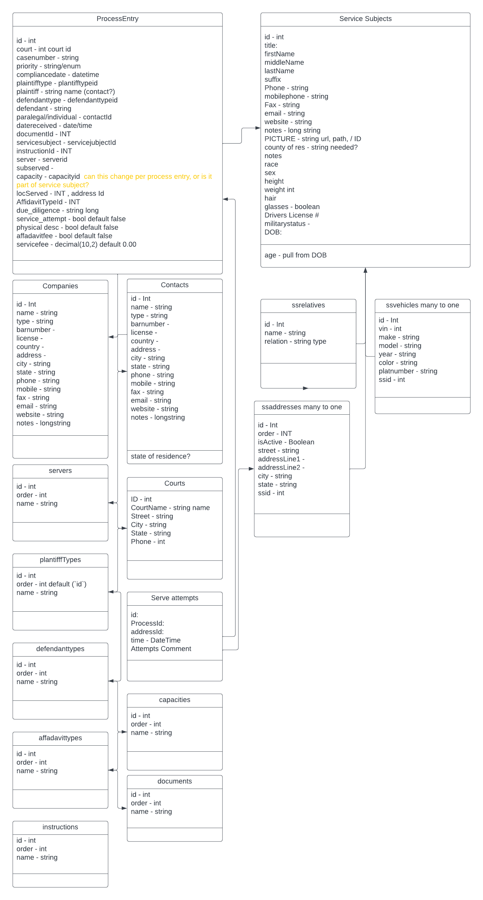
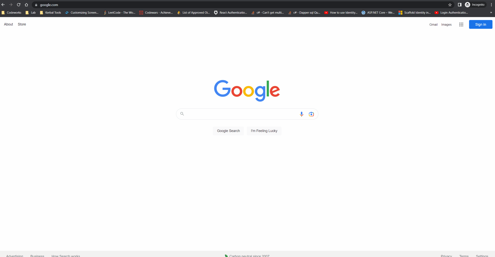
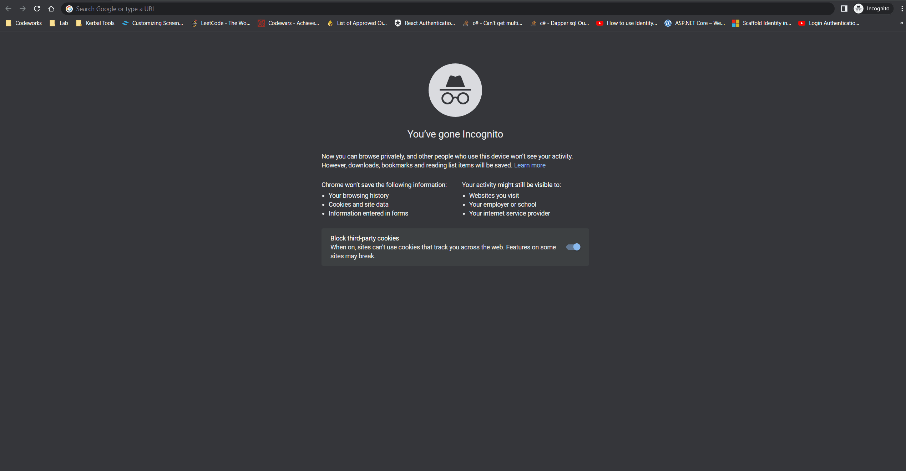

# Process Entry Application

This application is for my portfolio, needs driven by a real-world business app developed in MS Access for Tenacious Legal.

/ProcessEntryPlus (dotnet api server)
/processentryappclient (Typescript React)

The purpose was to learn more about database design, Dotnet Web API, authorization and typescript React. I am making sure I can get, post, edit all necessary data before designing. A lot of experience was gained in importing data from access to MySql, and normalizing data and tables. There is a long way to go for MVP for my portfolio but I wanted to document some of my progress.

## UML Diagram

## Routes are protected by Auth0 and process entry form
All Ids and names for the one-to-many tables populated with one API request into multiple fuzzy search ant design Select components. The ProcessEntryFromData model and ProcessEntryFromData controller used to get this data is in /ProcessEntryPlus

## API post request to Dotnet API
Post request works, and you can see the data inserted into MySQL.

## React router and useEffect
The form is populated if there is a match for the ID in the route

----------------------

This project was bootstrapped with [Create React App](https://github.com/facebook/create-react-app).

## Available Scripts

In the project directory, you can run:

### `npm start`

Runs the app in the development mode.\
Open [http://localhost:3000](http://localhost:3000) to view it in the browser.

The page will reload if you make edits.\
You will also see any lint errors in the console.

### `npm test`

Launches the test runner in the interactive watch mode.\
See the section about [running tests](https://facebook.github.io/create-react-app/docs/running-tests) for more information.

### `npm run build`

Builds the app for production to the `build` folder.\
It correctly bundles React in production mode and optimizes the build for the best performance.

The build is minified and the filenames include the hashes.\
Your app is ready to be deployed!

See the section about [deployment](https://facebook.github.io/create-react-app/docs/deployment) for more information.

### `npm run eject`

**Note: this is a one-way operation. Once you `eject`, you can’t go back!**

If you aren’t satisfied with the build tool and configuration choices, you can `eject` at any time. This command will remove the single build dependency from your project.

Instead, it will copy all the configuration files and the transitive dependencies (webpack, Babel, ESLint, etc) right into your project so you have full control over them. All of the commands except `eject` will still work, but they will point to the copied scripts so you can tweak them. At this point you’re on your own.

You don’t have to ever use `eject`. The curated feature set is suitable for small and middle deployments, and you shouldn’t feel obligated to use this feature. However we understand that this tool wouldn’t be useful if you couldn’t customize it when you are ready for it.

## Learn More

You can learn more in the [Create React App documentation](https://facebook.github.io/create-react-app/docs/getting-started).

To learn React, check out the [React documentation](https://reactjs.org/).
